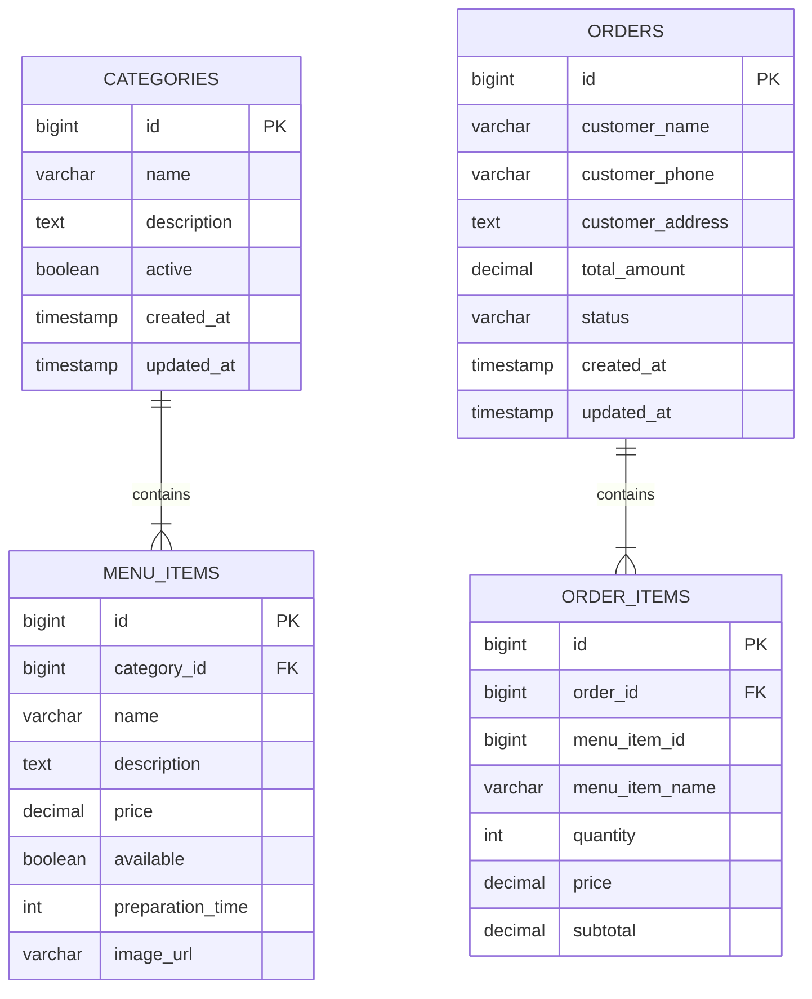

# 🍽️ Enterprise Restaurant Management System


[]()
[]()
[]()
[]()
[]()
[]()
[]()

*A high-performance, fault-tolerant backend system built with **Spring Boot**, **Spring Cloud**, **OpenFeign**, **Eureka**, and **Spring Cloud Gateway** using an event-ready Microservices Architecture.*


## 📌 Executive Overview

The **Restaurant Management System** is a distributed microservices platform engineered to handle core restaurant operations—ranging from dynamic catalog management to complex multi-item order processing—with precision and low latency.

By decoupling business capabilities into independent, self-contained services, the platform eliminates single points of failure inherent in legacy monoliths. Distributed communication is optimized via **Spring Cloud Netflix Eureka** for service registry, **Spring Cloud Gateway** for dynamic API routing, and declarative **OpenFeign** clients for resilient inter-service REST interactions.


## 🏛️ System Architecture


                      ┌───────────────────────────┐
                      │    Client / Frontend /    │
                      │      Postman / API        │
                      └─────────────┬─────────────┘
                                    │
                                    ▼ (Port 8080)
                      ┌───────────────────────────┐
                      │    Spring Cloud Gateway   │
                      └─────────────┬─────────────┘
                                    │
         ┌──────────────────────────┴──────────────────────────┐
         ▼ (Port 8082)                                         ▼ (Port 8083)


┌─────────────────────┐                               ┌─────────────────────┐
│    Menu Service     │◄──────────── OpenFeign ───────┤    Order Service    │
└──────────┬──────────┘       (Inter-Service IPC)     └──────────┬──────────┘
│                                                     │
│                ┌───────────────────┐                │
└───────────────►│   Eureka Server   │◄───────────────┘
│    (Port 8761)    │
└─────────┬─────────┘
│
▼
┌───────────────────┐
│   MySQL Database  │
└───────────────────┘


### Service Map & Port Allocation

| Component | Service Name | Port | Description |
| :--- | :--- | :--- | :--- |
| **Service Registry** | `restaurant-eureka-server` | `8761` | Dynamic service registration & health monitoring |
| **API Gateway** | `restaurant-api-gateway` | `8080` | Edge server routing, rate limiting & cross-cutting concerns |
| **Menu Service** | `restaurant-menu-service` | `8082` | Catalog management, menu categories, and item availability |
| **Order Service** | `restaurant-order-service` | `8083` | Order placement, state transitions, & price snapshotting |


## ✨ Core Features & Enterprise Patterns

### 🍔 Menu Microservice
* **Dynamic Cataloging:** Complete CRUD operations for categories and food items.
* **Real-time Inventory Rules:** Instant toggle for menu item availability and preparation times.
* **Elastic Search Support:** Search menu items filtered by category ID or availability status.

### 🛒 Order Microservice
* **Transactional Order Placement:** Atomic order creation supporting multi-item orders.
* **Data Consistency & Snapshots:** Menu item prices and names are snapshotted at order creation to guard against historic price adjustments.
* **Automated Bill Calculation:** Dynamic total and subtotal calculation via synchronous declarative REST checks.
* **State Machine:** Manage lifecycle transitions: `PENDING` ➔ `CONFIRMED` ➔ `PREPARING` ➔ `DELIVERED` / `CANCELLED`.

### ⚙ Infrastructure & Cross-Cutting
* **Service Discovery:** Automatic lookup via Netflix Eureka without hardcoded host/port bindings.
* **Resilient IPC:** Integrated **OpenFeign** clients with customized error decoders.
* **Enterprise Practices:** Centralized `GlobalExceptionHandler` with `@ControllerAdvice`, declarative Bean Validation (`jakarta.validation`), and uniform `DTO` mapping.


## 🛠️ Technology Stack

| Domain | Framework / Tool |
| :--- | :--- |
| **Runtime & Core** | Java 21 LTS, Spring Boot 3.x / 4.x |
| **Cloud Infrastructure** | Spring Cloud (Eureka, Spring Cloud Gateway, OpenFeign) |
| **Data & ORM** | Spring Data JPA, Hibernate, MySQL 8.x |
| **Build & Utilities** | Maven, Lombok, Jakarta Validation |
| **Documentation** | Springdoc OpenAPI, Swagger UI |


## 🗄️ Database Schemas



---

## 🔌 API Reference & Endpoints

All requests should be routed through the **API Gateway** (`http://localhost:8080`).

### 📦 Menu Service Routes (`/api/v1/menu`)

| Method | Endpoint | Description |
| --- | --- | --- |
| `GET` | `/api/v1/categories` | Retrieve all active menu categories |
| `POST` | `/api/v1/categories` | Create a new food category |
| `GET` | `/api/v1/items` | List all menu items |
| `GET` | `/api/v1/items/{id}` | Get specific menu item details |
| `GET` | `/api/v1/items/category/{categoryId}` | Get items by category |
| `POST` | `/api/v1/items` | Add a new menu item |
| `PUT` | `/api/v1/items/{id}` | Update item availability/price |

### 🛒 Order Service Routes (`/api/v1/orders`)

| Method | Endpoint | Description |
| --- | --- | --- |
| `POST` | `/api/v1/orders` | Place a new customer order |
| `GET` | `/api/v1/orders/{id}` | Fetch detailed order information |
| `GET` | `/api/v1/orders` | Fetch all historical orders |
| `PATCH` | `/api/v1/orders/{id}/status` | Update order processing status |

> **Interactive Swagger Documentation:**
> * Menu Service UI: `http://localhost:8082/swagger-ui/index.html`
> * Order Service UI: `http://localhost:8083/swagger-ui/index.html`
> 
> 

---

## 🚀 Getting Started

### Prerequisites

Ensure you have the following installed locally:

* **JDK 21** or higher
* **Apache Maven 3.9+**
* **MySQL 8.0+**

---

### Step 1: Database Setup

Create the target databases in your local MySQL instance:

```sql
CREATE DATABASE IF NOT EXISTS restaurant_menu_db;
CREATE DATABASE IF NOT EXISTS restaurant_order_db;

```

---

### Step 2: Configuration

Update `src/main/resources/application.yml` for both `menu-service` and `order-service` with your MySQL credentials:

```yaml
spring:
  datasource:
    url: jdbc:mysql://localhost:3306/restaurant_menu_db?useSSL=false&serverTimezone=UTC
    username: YOUR_MYSQL_USERNAME
    password: YOUR_MYSQL_PASSWORD

```

---

### Step 3: Build & Execution Sequence

Clone the repository and build the modules:

```bash
git clone [https://github.com/Mehraj7744/Restaurant-Management-System.git](https://github.com/Mehraj7744/Restaurant-Management-System.git)
cd Restaurant-Management-System
mvn clean install

```

Start the services in the following **exact order**:

```bash
# 1. Start Eureka Registry (Port 8761)
cd restaurant-eureka-server && mvn spring-boot:run

# 2. Start API Gateway (Port 8080)
cd ../restaurant-api-gateway && mvn spring-boot:run

# 3. Start Business Microservices
cd ../restaurant-menu-service && mvn spring-boot:run
cd ../restaurant-order-service && mvn spring-boot:run

```

Verification: Access the Eureka Dashboard at `http://localhost:8761` to verify that all microservices are registered and UP.

---

## 📌 Future Enhancements

* [ ] **Security Layer:** Centralized OAuth2 / JWT Auth Service with Spring Security.
* [ ] **Event-Driven Architecture:** Asynchronous message brokers using Apache Kafka / RabbitMQ.
* [ ] **Resilience:** Circuit Breakers and Rate Limiting using **Resilience4j**.
* [ ] **Containerization & Orchestration:** Full Dockerization with `docker-compose` and K8s manifests.
* [ ] **Observability:** Distributed tracing with Zipkin/Micrometer and metrics collection with Prometheus & Grafana.

---

## 👨‍💻 Author

**Mehraj Pathan**

*Java Full Stack Developer / Software Architect*

* **Email:** [mehrajpathan7744@gmail.com](https://www.google.com/search?q=mailto%3Amehrajpathan7744%40gmail.com)
* **LinkedIn:** [linkedin.com/in/mehraj-pathan-a03532308](https://www.linkedin.com/in/mehraj-pathan-a03532308/)
* **GitHub:** [@Mehraj7744](https://github.com/Mehraj7744)

---
